# The Complete Vision AI Guide

### From Pixels to Production: A Practical Handbook for AI Engineers

> A comprehensive, beginner-friendly reference covering Computer Vision, OCR, Document AI, Multimodal AI, and how to ship production-ready vision applications with FastAPI and modern Vision APIs.

**Audience:** Developers who know basic Python but have never worked with AI Vision before.
**Format:** Concept -> Diagram -> Code -> Best Practice, repeated throughout.

---

## Table of Contents

1. [Introduction](#1-introduction)
2. [Vision AI Fundamentals](#2-vision-ai-fundamentals)
3. [How Vision AI Works](#3-how-vision-ai-works)
4. [Multimodal AI](#4-multimodal-ai)
5. [OCR (Optical Character Recognition)](#5-ocr-optical-character-recognition)
6. [Document AI](#6-document-ai)
7. [Receipt Analysis](#7-receipt-analysis)
8. [Image Captioning](#8-image-captioning)
9. [Object Detection](#9-object-detection)
10. [Image Classification](#10-image-classification)
11. [OpenAI Vision API](#11-openai-vision-api)
12. [FastAPI Integration](#12-fastapi-integration)
13. [Frontend Integration](#13-frontend-integration)
14. [Prompt Engineering for Vision](#14-prompt-engineering-for-vision)
15. [Production Architecture](#15-production-architecture)
16. [Security Best Practices](#16-security-best-practices)
17. [Performance Optimization](#17-performance-optimization)
18. [Deployment](#18-deployment)
19. [Repository Structure](#19-repository-structure)
20. [Common Mistakes](#20-common-mistakes)
21. [FAQ](#21-faq)
22. [Best Practices Checklist](#22-best-practices-checklist)
23. [Learning Roadmap](#23-learning-roadmap)
24. [Project Walkthroughs](#24-project-walkthroughs)
25. [Comparison of AI Vision Providers](#25-comparison-of-ai-vision-providers)
26. [Further Resources](#26-further-resources)

---

## 1. Introduction

### What is Computer Vision?

Computer Vision (CV) is the field of computer science concerned with teaching machines to *see* - that is, to extract meaningful information from digital images and video. Instead of a human looking at a photo and understanding "this is an invoice from Acme Corp for $412.50," a computer vision system processes the raw grid of pixel values and produces the same understanding programmatically.

Classic computer vision problems include:

- **"What is in this image?"** -> Image classification
- **"Where is it?"** -> Object detection / localization
- **"What does this pixel belong to?"** -> Segmentation
- **"What does this text say?"** -> Optical Character Recognition (OCR)
- **"What is happening in this image?"** -> Scene understanding / captioning

### What is AI Vision?

"AI Vision" (also called **Vision AI**) refers to the modern generation of computer vision systems powered by deep learning - and increasingly, by large multimodal models that combine vision with language understanding. Where traditional computer vision relied on hand-crafted rules and mathematical filters, AI Vision systems *learn* to recognize patterns directly from massive datasets of labeled images.

The most important recent shift is the rise of **vision-language models (VLMs)** - models like GPT-4o/GPT-4.1, Claude, and Gemini that can accept an image as input and reason about it in natural language, the same way they reason about text. This is the technology this guide focuses on: instead of training a specialized model for every vision task, you can send an image to a general-purpose vision-language model and simply *ask* it what you want to know.

### History of Computer Vision

| Era | Approximate years | Key developments |
|---|---|---|
| Early vision research | 1960s-1970s | Edge detection, simple pattern recognition, "Summer Vision Project" (MIT, 1966) attempted to solve vision in a summer - it took 50+ years |
| Classical CV | 1980s-2000s | Hand-crafted features: SIFT, HOG, Haar cascades; OpenCV founded (2000) |
| Machine learning era | 2000s-2011 | Support Vector Machines, Random Forests applied to visual features |
| Deep learning breakthrough | 2012 | AlexNet wins ImageNet - convolutional neural networks (CNNs) become dominant |
| CNN maturity | 2014-2019 | VGG, ResNet, Inception, YOLO, Mask R-CNN - detection and segmentation mature |
| Transformers arrive | 2020-2021 | Vision Transformer (ViT), CLIP (OpenAI) connect images and text in a shared embedding space |
| Multimodal LLM era | 2023-present | GPT-4V, GPT-4o, Claude 3+, Gemini - general-purpose models that see *and* reason |

### Traditional Computer Vision vs. Modern AI Vision

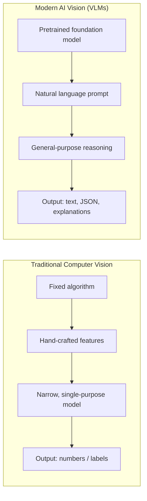

| Aspect | Traditional CV (e.g. OpenCV, Tesseract) | Modern AI Vision (e.g. GPT-4o, Claude) |
|---|---|---|
| Setup | Requires training/tuning per task | Works out-of-the-box via a prompt |
| Flexibility | One model = one narrow task | One model handles many tasks |
| Handwriting | Poor to moderate | Strong |
| Context understanding | None (pixels only) | Strong (reasons about meaning) |
| Cost | One-time compute, runs locally | Pay-per-request, needs network access |
| Latency | Very low (milliseconds) | Higher (seconds), network-bound |
| Explainability | Deterministic, debuggable | Probabilistic, less deterministic |
| Best for | High-volume, well-defined, offline tasks | Complex, varied, or novel document types |

In production systems, these approaches are often **combined**: traditional CV for cheap, fast, high-volume preprocessing (cropping, deskewing, quality checks) and AI Vision for the actual understanding step.

### Real-World Applications

| Industry | Application | Vision technique |
|---|---|---|
| Finance | Automated invoice/receipt processing | OCR + Document AI |
| Healthcare | Medical imaging triage | Image classification |
| Retail | Visual search, shelf auditing | Object detection |
| Insurance | Damage assessment from photos | Image captioning + classification |
| Logistics | License plate & package label reading | OCR |
| Security | Access control, anomaly detection | Object detection + classification |
| Accessibility | Automatic alt-text for images | Image captioning |
| Manufacturing | Defect detection on assembly lines | Object detection + classification |
| Legal | Contract and ID document verification | Document AI |

---

## 2. Vision AI Fundamentals

Before working with any vision model, it helps to understand what an image actually *is* to a computer.

### Pixels

A digital image is a grid of **pixels** (picture elements). Each pixel holds one or more numeric values describing its color and brightness. A 1920x1080 image contains 2,073,600 individual pixels - every vision system, no matter how advanced, ultimately starts from this grid of numbers.

### Images as Arrays

Programmatically, an image is just a multi-dimensional array (a tensor). A color image is typically represented as an array of shape `(height, width, channels)`:

```python
import numpy as np

# A tiny 2x2 RGB image, as a computer actually sees it
image = np.array([
    [[255, 0, 0], [0, 255, 0]],   # red pixel, green pixel
    [[0, 0, 255], [255, 255, 255]]  # blue pixel, white pixel
], dtype=np.uint8)

print(image.shape)  # (2, 2, 3) -> height=2, width=2, channels=3 (RGB)
```

### Color Spaces (RGB, BGR, Grayscale)

| Color space | Channels | Notes |
|---|---|---|
| **RGB** | Red, Green, Blue | The standard for web, displays, and most ML frameworks (PIL, PyTorch) |
| **BGR** | Blue, Green, Red | OpenCV's default channel order - a very common source of bugs when mixing libraries |
| **Grayscale** | 1 (intensity) | Reduces data size; used when color carries no useful information (e.g. document scans) |
| **HSV** | Hue, Saturation, Value | Useful for color-based filtering, more robust to lighting changes than RGB |
| **CMYK** | Cyan, Magenta, Yellow, Key (black) | Used in printing, rarely used directly in ML pipelines |

> **Common bug:** loading an image with OpenCV (`cv2.imread`) gives you BGR order, but most vision models and libraries expect RGB. Forgetting to convert (`cv2.cvtColor(img, cv2.COLOR_BGR2RGB)`) silently swaps your red and blue channels.

### Image Resolution

Resolution is the pixel count of an image, usually written as `width x height` (e.g. `1024x768`). Higher resolution means more detail, but also more data to transmit and process. For AI Vision APIs, higher resolution generally improves OCR/text-reading accuracy but increases both cost and latency - most providers internally downscale very large images anyway, so there's a practical ceiling beyond which extra resolution stops helping.

### Channels

A "channel" is one layer of the image array holding a single type of information - e.g., the red channel, the green channel, or the blue channel in an RGB image. Some formats include a fourth **alpha channel** (RGBA) that encodes transparency.

### Image Formats

| Format | Compression | Transparency | Best for |
|---|---|---|---|
| **JPEG (.jpg)** | Lossy | No | Photos, general use, smaller file sizes |
| **PNG (.png)** | Lossless | Yes | Screenshots, diagrams, images needing transparency |
| **WEBP** | Lossy or lossless | Yes | Modern web use, smaller than JPEG/PNG at similar quality |
| **GIF** | Lossless (limited palette) | Yes (binary) | Simple animations, low-color graphics |
| **BMP** | None (usually) | No | Rarely used; large file sizes |
| **TIFF** | Lossless (usually) | Yes | Scanning, printing, archival document storage |
| **HEIC/HEIF** | Lossy | Yes | Default format on modern iPhones |

### Metadata

Images often carry metadata beyond pixel data - most commonly **EXIF** data: camera model, capture date, GPS coordinates, and crucially, **orientation**. A photo can be stored "sideways" in pixel data with an EXIF flag telling viewers to rotate it 90°. If your pipeline reads raw pixels without respecting EXIF orientation, you can accidentally feed a sideways image into your vision model - a very common real-world OCR bug.

### Compression

- **Lossless compression** (PNG, TIFF) preserves every pixel exactly but produces larger files.
- **Lossy compression** (JPEG) discards some information to shrink file size, which can introduce artifacts that hurt OCR accuracy on fine text, especially at low quality settings.

**Rule of thumb:** for document scans and text-heavy images, prefer PNG or high-quality JPEG (≥85% quality). For photos of natural scenes, standard JPEG compression is usually fine.

---

## 3. How Vision AI Works

### The Vision AI Pipeline

Modern vision-language systems follow a consistent high-level pipeline, whether you're calling a hosted API or running a local model:

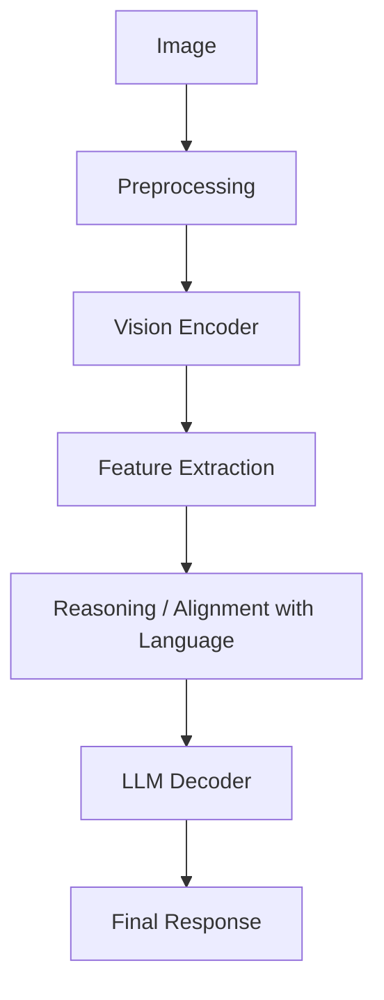

**Step-by-step explanation:**

1. **Image** - The raw input: a JPEG, PNG, or similar file, either uploaded by a user or captured from a camera.
2. **Preprocessing** - The image is decoded, resized/normalized to the dimensions the model expects, and converted into a numeric tensor. This may include cropping, orientation correction, and color normalization.
3. **Vision Encoder** - A neural network (often a Vision Transformer, ViT) converts the image into a sequence of numerical **patch embeddings** - compact vector representations of small regions of the image.
4. **Feature Extraction** - The encoder's output captures shapes, textures, layout, and text-like patterns as high-dimensional feature vectors, independent of the original pixel grid.
5. **Reasoning / Alignment with Language** - In a multimodal model, these image features are projected into the *same embedding space* used by the language model, so image content and text content become directly comparable and combinable.
6. **LLM Decoder** - A large language model processes the combined image features and your text prompt together, using its general reasoning ability to answer questions, extract text, or describe the scene.
7. **Final Response** - The model produces natural language (or structured JSON, if requested) as its output.

### Why This Matters for Engineers

You don't need to implement any of these internal steps yourself when using a hosted Vision API (like OpenAI's) - the provider handles steps 2 through 6. What you *do* control, and what this guide focuses on, is:

- **Step 1**: how you capture and validate the image
- **The prompt**: how you instruct the model at step 5-6
- **Step 7**: how you parse, validate, and use the model's response

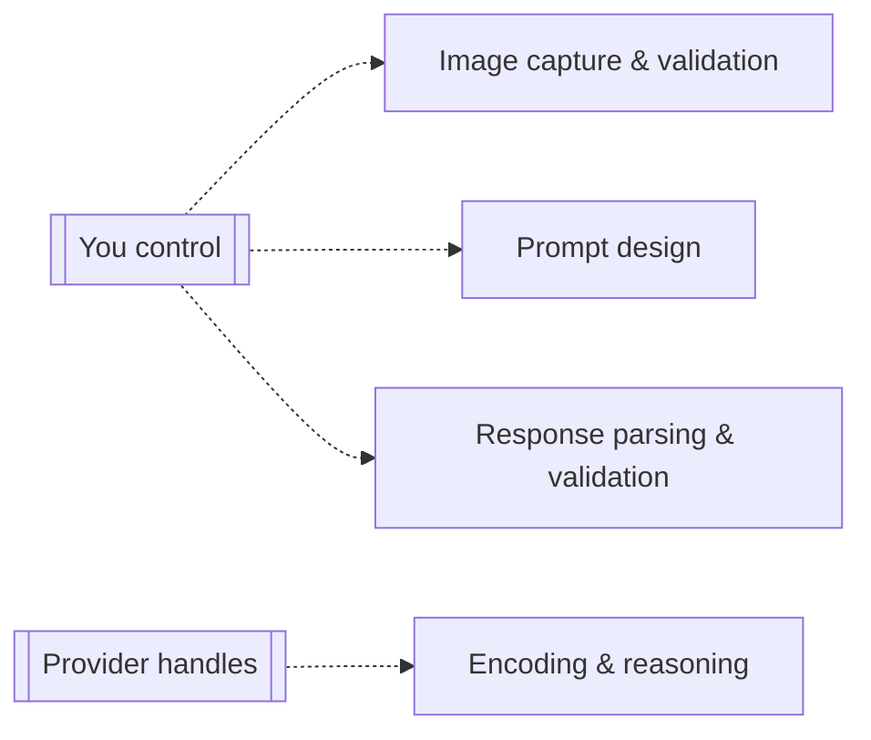

---

## 4. Multimodal AI

### What Multimodal Models Are

A **multimodal model** can accept and/or generate more than one type of data - text, images, audio, video - within a single unified architecture. Rather than chaining together separate specialized models (one for vision, one for language, one for speech), a multimodal model reasons across modalities jointly, which produces more coherent and context-aware results.

### Text + Image

The most mature and widely deployed multimodal combination. You send text (instructions/questions) and one or more images together; the model reasons about both jointly. This is the foundation of everything in this guide - OCR, captioning, document understanding, and visual question answering are all "text + image" tasks.

```python
# Conceptual example: text + image reasoning
prompt = "What is the total amount due on this invoice, and when is it due?"
# image: invoice.png
# The model reads the image AND understands the natural-language question,
# then reasons across both to produce a grounded answer.
```

### Image + Audio

Combines visual and auditory understanding - for example, a model that watches a video clip and also listens to its audio track to answer "what did the speaker point at when they said 'this one'?" This requires the model to align spoken references with visual objects over time.

### Image + Video

Video is effectively a sequence of images (frames) plus a temporal dimension. Multimodal video models must track objects and actions *across* frames, not just within a single frame - enabling tasks like action recognition, video summarization, and moment retrieval ("find the part where the dog jumps").

### Why Multimodal AI Is Important

- **Fewer specialized models to maintain.** One general-purpose model can replace several narrow, single-task pipelines.
- **Better grounding.** Combining modalities reduces ambiguity - "the red one" is meaningless as text alone, but trivial to resolve with an accompanying image.
- **Natural interfaces.** Users can ask questions in plain language about images, rather than learning a specialized query language or UI.
- **Emergent capabilities.** Multimodal training often produces reasoning abilities (like reading a chart and explaining its trend) that weren't explicitly programmed.

**Real-world examples:** a customer support bot that reads a screenshot of an error message and explains the fix; a shopping assistant that identifies a product from a photo and finds similar items; an accessibility tool that describes a webpage's images aloud in real time.

---

## 5. OCR (Optical Character Recognition)

### What OCR Is

OCR converts text that exists inside an image - printed, typed, or handwritten - into machine-readable, editable text (a string your code can search, copy, store, and process).

### How OCR Works

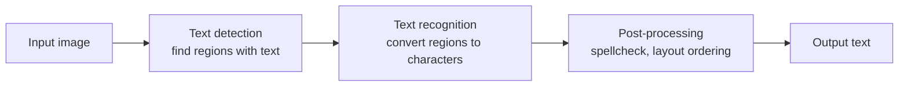

Traditional OCR engines (e.g., Tesseract) perform this as a distinct multi-stage pipeline: detect text regions, segment individual characters, classify each character against a font model, then reassemble words using a dictionary/language model. Modern vision-language models instead perform detection and recognition **jointly**, as part of the same neural forward pass that also produces reasoning - which is why they handle messy, rotated, or handwritten text far more gracefully.

### Printed Text Recognition

The classic OCR case: clean, machine-printed text at a known font and size. This is the easiest case for both traditional OCR and AI Vision, and traditional engines like Tesseract often perform very well here at a fraction of the cost of an API call.

### Handwriting Recognition

Historically one of the hardest CV problems - handwriting varies enormously between individuals, and traditional OCR engines perform poorly on it. Modern vision-language models handle handwriting substantially better because they've been trained on huge, varied datasets and reason about *context* (e.g., inferring an ambiguous letter from the surrounding word), not just the shape of a single character in isolation.

### Document OCR

Extracting all text from a structured document (a contract, a report, a form) while trying to preserve reading order, section breaks, and general layout - not just a flat blob of text.

### Invoice OCR

Extracting specific fields from an invoice: vendor name, invoice number, line items, subtotal, tax, total, due date. This blends OCR with **Document AI** (see Section 6) since it requires understanding the *meaning* of extracted text, not just transcribing it.

### Receipt OCR

Similar to invoice OCR but for retail receipts: merchant name, purchase date, individual items and prices, tax, tip, and total. Covered in depth in Section 7.

### Passport OCR

Extracting structured identity fields (name, passport number, date of birth, nationality, expiration date) from a passport's photo page, often including the **Machine Readable Zone (MRZ)** - the two lines of monospaced characters at the bottom, which follow a strict ICAO format that can be parsed with high confidence once correctly transcribed.

### Business Card OCR

Extracting contact fields (name, title, company, phone, email, address) from a photographed business card - a task made harder by highly variable, decorative layouts compared to standardized documents.

### Production OCR Example

```python
from openai import OpenAI

client = OpenAI()

def extract_text_from_image(image_data_url: str) -> str:
    """Extract all visible text from an image using a vision-language model."""
    response = client.responses.create(
        model="gpt-4.1-mini",
        input=[
            {
                "role": "user",
                "content": [
                    {
                        "type": "input_text",
                        "text": (
                            "Transcribe every piece of text visible in this image "
                            "verbatim. Preserve line breaks and reading order. "
                            "Do not translate or summarize."
                        ),
                    },
                    {"type": "input_image", "image_url": image_data_url},
                ],
            }
        ],
    )
    return response.output_text
```

---

## 6. Document AI

### Document Understanding

**Document AI** goes a step beyond OCR: instead of just transcribing text, it understands the document's **structure and meaning** - what role each piece of text plays (a heading vs. a line item vs. a signature block), and how pieces relate to each other.

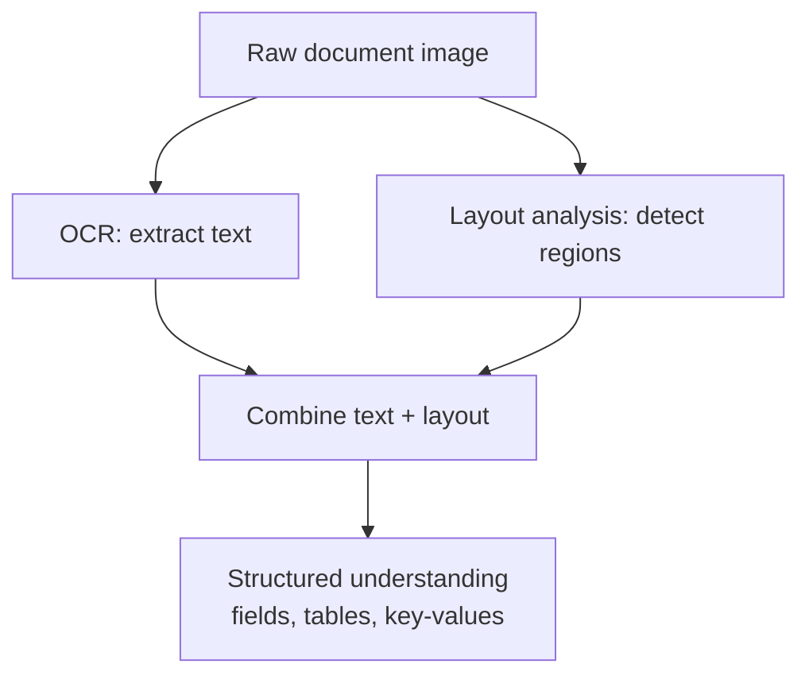

### Layout Analysis

Identifying the *visual structure* of a page: where the title is, where paragraphs start and end, where a table or a signature block sits, and the reading order across multiple columns. Layout matters enormously - the same text in a different position can mean something completely different (e.g., a total in a table footer vs. a total mentioned in a warranty disclaimer paragraph).

### Tables

Extracting tabular data requires recognizing rows, columns, and cell boundaries - then mapping OCR'd text into the correct grid position. This is one of the harder Document AI sub-problems, especially with merged cells, missing gridlines, or multi-page tables.

### Forms

Forms mix static labels ("Date of Birth:") with variable, filled-in values. Good form extraction correctly pairs each label with its corresponding answer, even when the layout is inconsistent between different form instances.

### Structured Extraction

The general term for turning unstructured document content into a structured format (JSON, a database row, a spreadsheet) that downstream code can reliably consume - this is usually the actual business goal behind "reading" a document.

### Key-Value Extraction

A common structured-extraction pattern: pulling out `{"key": "value"}` pairs directly from a document, e.g. `{"Invoice Number": "INV-2026-0042", "Due Date": "2026-08-15"}`. Vision-language models are well suited to this because the same underlying capability - reading text with an understanding of context - naturally maps a label to its corresponding value.

### PDF Analysis

PDFs are not images - they're a page-description format that can contain a mix of vector text, embedded images, and metadata. Two common cases:

| PDF type | How to process it |
|---|---|
| **Text-based PDF** (text was typed, not scanned) | Extract text directly with a PDF library (e.g. `pypdf`, `pdfplumber`) - no vision model needed |
| **Scanned/image-based PDF** (a photocopy or scan) | Render each page to an image, then run it through a vision model like any other image |

```python
from pdf2image import convert_from_path

def pdf_pages_to_images(pdf_path: str) -> list:
    """Render each page of a scanned PDF as an image for vision processing."""
    return convert_from_path(pdf_path, dpi=200)
```

### Structured Output Example

```python
from pydantic import BaseModel
from openai import OpenAI

class InvoiceFields(BaseModel):
    vendor_name: str
    invoice_number: str
    invoice_date: str
    total_amount: float
    currency: str

client = OpenAI()

def extract_invoice_fields(image_data_url: str) -> InvoiceFields:
    response = client.responses.parse(
        model="gpt-4.1-mini",
        input=[
            {
                "role": "user",
                "content": [
                    {"type": "input_text", "text": "Extract the key fields from this invoice."},
                    {"type": "input_image", "image_url": image_data_url},
                ],
            }
        ],
        text_format=InvoiceFields,
    )
    return response.output_parsed
```

## 7. Receipt Analysis

Receipt analysis is one of the most common real-world Vision AI use cases (expense tracking, accounting automation, reimbursement apps). It combines OCR, layout understanding, and light arithmetic reasoning.

### Workflow

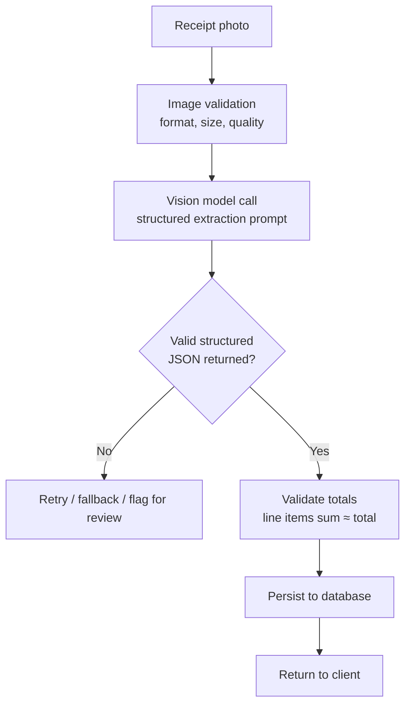

### Fields to Extract

| Field | Description | Notes |
|---|---|---|
| Merchant | Business/store name | Often the largest text at the top |
| Date | Purchase date | Normalize to ISO 8601 (`YYYY-MM-DD`) |
| Currency | Currency of the transaction | Infer from symbol or merchant locale if not explicit |
| Line items | Individual purchased items with price | May include quantity and per-unit price |
| Subtotal | Sum before tax/tip | Useful for validating extraction |
| Tax | Sales tax / VAT amount | May be split into multiple tax lines |
| Tip | Gratuity, if present | Common on restaurant receipts |
| Total | Final amount charged | Cross-check against subtotal + tax + tip |

### Merchant, Date & Currency Extraction

These are usually the easiest fields - merchant name is typically the most prominent text, the date follows common patterns the model recognizes natively, and currency can be inferred from symbols (`$`, `€`, `£`) or explicit currency codes.

### Tax Extraction

Tax lines vary widely by region (sales tax, VAT, GST, multiple tax bands) - a good prompt should ask the model to report tax **as it appears**, rather than assuming a single fixed tax field, and your schema should tolerate a list of tax entries.

### Total Calculation & Validation

Never blindly trust the extracted total. A cheap and effective sanity check: parse line items, sum them, add tax and tip, and compare to the extracted total. A large mismatch is a strong signal the extraction has an error worth flagging for manual review.

```python
def validate_receipt_math(receipt: dict, tolerance: float = 0.05) -> bool:
    """Return True if line items + tax + tip roughly match the extracted total."""
    items_sum = sum(item["price"] for item in receipt.get("line_items", []))
    computed = items_sum + receipt.get("tax", 0) + receipt.get("tip", 0)
    return abs(computed - receipt.get("total", 0)) <= tolerance
```

### Line Item Extraction

Each line item typically has a description, quantity, unit price, and line total. Ambiguity is common (abbreviated product names, missing quantities) - a well-designed schema should make quantity and unit price *optional*, since not every receipt includes them.

### Structured JSON Output

```python
from pydantic import BaseModel, Field
from openai import OpenAI

class LineItem(BaseModel):
    description: str
    quantity: float = 1.0
    unit_price: float | None = None
    total_price: float

class Receipt(BaseModel):
    merchant: str
    date: str
    currency: str
    line_items: list[LineItem]
    subtotal: float | None = None
    tax: float | None = None
    tip: float | None = None
    total: float

client = OpenAI()

def analyze_receipt(image_data_url: str) -> Receipt:
    response = client.responses.parse(
        model="gpt-4.1-mini",
        input=[
            {
                "role": "user",
                "content": [
                    {
                        "type": "input_text",
                        "text": "Extract every field from this receipt into the given schema. "
                                 "If a field is not present, omit it rather than guessing.",
                    },
                    {"type": "input_image", "image_url": image_data_url},
                ],
            }
        ],
        text_format=Receipt,
    )
    return response.output_parsed
```

---

## 8. Image Captioning

### What Image Captioning Is

Image captioning generates a natural-language description of an image's content - answering "what is shown in this picture?" in a sentence or short paragraph, rather than extracting text or coordinates.

### Dense Captioning

Standard captioning produces one sentence for the whole image ("A golden retriever running on a beach"). **Dense captioning** goes further, generating separate descriptions for multiple regions or objects within a single image ("a golden retriever mid-stride on wet sand," "a red frisbee in the air," "waves breaking in the background") - useful for detailed indexing and search.

### Accessibility Captions

Alt-text for screen readers is a critical accessibility use case. Good accessibility captions are concise, describe the *functionally relevant* content (not every visual detail), and avoid redundant phrases like "image of" (screen readers already announce that it's an image).

### Automatic Image Description

Used at scale for cataloging large image libraries - e.g., auto-tagging a stock photo library, generating searchable descriptions for a company's internal asset management system, or producing draft descriptions for e-commerce product photos.

### Practical Applications

| Use case | Caption style |
|---|---|
| E-commerce product listings | Descriptive, feature-focused ("blue ceramic mug with wooden handle, 350ml") |
| Accessibility / alt-text | Concise, functional, screen-reader friendly |
| Social media / content moderation | Neutral, factual description for automated review |
| Digital asset management | Keyword-rich, optimized for search |
| Journalism / archives | Objective, includes identifiable context (place, event, if evident) |

```python
def generate_alt_text(image_data_url: str) -> str:
    response = client.responses.create(
        model="gpt-4.1-mini",
        input=[
            {
                "role": "user",
                "content": [
                    {
                        "type": "input_text",
                        "text": "Write a concise, one-sentence accessibility alt-text "
                                 "description for this image, suitable for a screen reader. "
                                 "Do not start with 'image of' or 'picture of'.",
                    },
                    {"type": "input_image", "image_url": image_data_url},
                ],
            }
        ],
    )
    return response.output_text
```

---

## 9. Object Detection

### Bounding Boxes

Object detection identifies *where* specific objects are within an image, typically represented as a **bounding box** - a rectangle defined by coordinates (e.g., `x_min, y_min, x_max, y_max`, or `x, y, width, height`) drawn around each detected object.

### Labels

Each detected bounding box is paired with a **label** - the class name of the object it contains (`"person"`, `"car"`, `"dog"`, `"invoice_total_field"` for a custom domain model).

### Confidence Scores

Detection models output a **confidence score** (0.0-1.0) for each detection, representing the model's certainty. Production systems typically apply a confidence threshold (e.g., discard anything below 0.5) to filter out low-quality detections, tuned based on the acceptable false-positive/false-negative tradeoff for the application.

### Multiple Object Detection

Unlike classification (one label per image), detection handles images containing **many** objects of potentially different classes simultaneously - e.g., a street scene with cars, pedestrians, and traffic signs all detected and boxed independently.

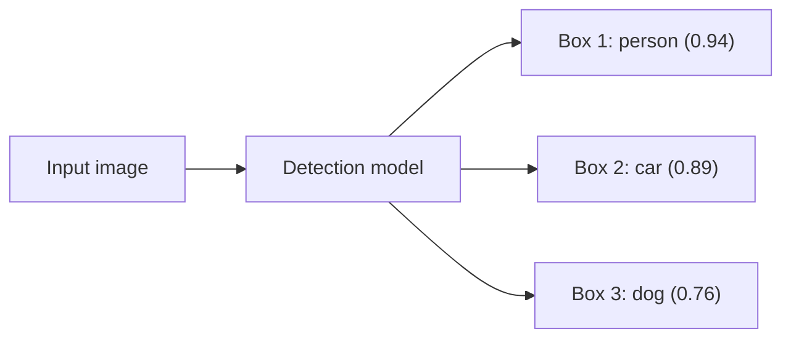

### When Object Detection Is Used

- **Retail:** shelf auditing, planogram compliance, inventory counting
- **Security:** perimeter monitoring, restricted-zone alerts
- **Autonomous systems:** obstacle detection for robots/vehicles
- **Manufacturing:** defect localization on a production line
- **Sports analytics:** tracking players/ball position across frames

> **Note:** general-purpose vision-language models like GPT-4o can describe *what* is in an image and roughly *where* in relative terms ("top-left," "in the foreground"), but dedicated object detection models (YOLO, Detectron2, or cloud detection APIs) remain the standard choice when you need precise, reliable pixel-coordinate bounding boxes at scale.

---

## 10. Image Classification

### Single-Label Classification

The image is assigned exactly **one** class from a fixed set of possibilities - e.g., classifying a medical scan as "normal" or "abnormal," or a product photo as belonging to one category ("electronics," "clothing," "furniture").

### Multi-Label Classification

The image can be assigned **multiple, simultaneously true** labels - e.g., a photo tagged with both `"outdoor"` and `"beach"` and `"sunset"` at once, since these attributes aren't mutually exclusive.

### Classification Workflow

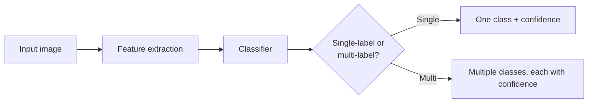

### Practical Examples

```python
from pydantic import BaseModel
from typing import Literal

class DocumentType(BaseModel):
    document_type: Literal["invoice", "receipt", "passport", "business_card", "other"]
    confidence_reasoning: str

def classify_document(image_data_url: str) -> DocumentType:
    response = client.responses.parse(
        model="gpt-4.1-mini",
        input=[
            {
                "role": "user",
                "content": [
                    {"type": "input_text", "text": "Classify what type of document this image shows."},
                    {"type": "input_image", "image_url": image_data_url},
                ],
            }
        ],
        text_format=DocumentType,
    )
    return response.output_parsed
```

A common production pattern is to run a lightweight **classification step first** (what kind of document is this?) and then route the image to a **specialized extraction prompt** tailored to that document type - invoices, receipts, and passports each benefit from different field schemas and instructions.

---

## 11. OpenAI Vision API

### Image Input

The OpenAI Responses API accepts images as part of a message's content, alongside text. Images can be provided as:

- A hosted **URL** (`https://...`)
- A **base64-encoded data URL** (`data:image/png;base64,...`) - required when the image isn't already hosted somewhere public, such as a freshly uploaded file

```python
import base64

def to_data_url(image_bytes: bytes, mime_type: str = "image/png") -> str:
    encoded = base64.b64encode(image_bytes).decode("ascii")
    return f"data:{mime_type};base64,{encoded}"
```

### The Responses API

The Responses API (`client.responses.create`) is OpenAI's current interface for both text and multimodal requests, replacing the older Chat Completions pattern for new development. A vision request is a normal message where the `content` list mixes `input_text` and `input_image` blocks:

```python
from openai import OpenAI

client = OpenAI()  # reads OPENAI_API_KEY from the environment

response = client.responses.create(
    model="gpt-4.1-mini",
    input=[
        {
            "role": "user",
            "content": [
                {"type": "input_text", "text": "Describe this image in one sentence."},
                {"type": "input_image", "image_url": "https://example.com/photo.jpg"},
            ],
        }
    ],
)

print(response.output_text)
```

### Vision Prompts

A vision prompt has two parts working together: the **instruction** (what you want) and the **image** (what to look at). Being explicit about the desired format, scope, and edge-case behavior dramatically improves reliability - see Section 14 for detailed prompt patterns.

### OCR Prompts

```python
OCR_PROMPT = (
    "Transcribe all text visible in this image exactly as written. "
    "Preserve line breaks and original formatting. Do not translate, "
    "summarize, or omit any text, including small print."
)
```

### Caption Prompts

```python
CAPTION_PROMPT = (
    "Write a single, clear sentence describing what is shown in this image, "
    "suitable for someone who cannot see it."
)
```

### Structured Output

For production use, **always** prefer structured output over asking for free-form text and parsing it yourself. The Responses API's `responses.parse()` helper, combined with a Pydantic model, guarantees the response matches your schema:

```python
from pydantic import BaseModel

class Caption(BaseModel):
    caption: str
    contains_text: bool
    dominant_colors: list[str]

response = client.responses.parse(
    model="gpt-4.1-mini",
    input=[
        {
            "role": "user",
            "content": [
                {"type": "input_text", "text": "Analyze this image."},
                {"type": "input_image", "image_url": image_data_url},
            ],
        }
    ],
    text_format=Caption,
)

result: Caption = response.output_parsed
```

### Streaming Responses

For a responsive UI, stream tokens as they're generated instead of waiting for the full response:

```python
async def stream_description(image_data_url: str):
    async with client.responses.stream(
        model="gpt-4.1-mini",
        input=[
            {
                "role": "user",
                "content": [
                    {"type": "input_text", "text": "Describe this image in detail."},
                    {"type": "input_image", "image_url": image_data_url},
                ],
            }
        ],
    ) as stream:
        async for event in stream:
            if event.type == "response.output_text.delta":
                yield event.delta
```

---

## 12. FastAPI Integration

### Image Upload Endpoints

FastAPI accepts file uploads via `UploadFile`, typically combined with form fields for extra options:

```python
from fastapi import FastAPI, UploadFile, Form

app = FastAPI()

@app.post("/api/vision/analyze")
async def analyze_image(file: UploadFile, mode: str = Form(default="caption")):
    image_bytes = await file.read()
    # ... validate, process, return result
```

### Multipart Uploads

Browsers send file uploads as `multipart/form-data`. FastAPI handles this automatically via `UploadFile`, but requires the `python-multipart` package to be installed:

```bash
pip install python-multipart
```

### Image Validation

Never trust a client-supplied `Content-Type` header or file extension - validate the actual file content:

```python
_SIGNATURES = {
    b"\xff\xd8\xff": "image/jpeg",
    b"\x89PNG\r\n\x1a\n": "image/png",
}

def sniff_image_type(data: bytes) -> str | None:
    for signature, mime in _SIGNATURES.items():
        if data.startswith(signature):
            return mime
    return None

MAX_UPLOAD_BYTES = 8 * 1024 * 1024  # 8 MB

async def validate_upload(file: UploadFile) -> bytes:
    data = await file.read()
    if not data:
        raise ValueError("Empty file")
    if len(data) > MAX_UPLOAD_BYTES:
        raise ValueError("File too large")
    if sniff_image_type(data) is None:
        raise ValueError("Unsupported or unrecognized image format")
    return data
```

### Processing Pipeline

```python
from fastapi import HTTPException

@app.post("/api/vision/ocr")
async def ocr_endpoint(file: UploadFile):
    try:
        image_bytes = await validate_upload(file)
    except ValueError as exc:
        raise HTTPException(status_code=400, detail=str(exc))

    data_url = to_data_url(image_bytes, mime_type="image/png")
    text = extract_text_from_image(data_url)  # calls the vision model
    return {"filename": file.filename, "text": text, "char_count": len(text)}
```

### API Responses

Design consistent response schemas with Pydantic so consumers (including your own frontend) always know what shape to expect, including for errors:

```python
from pydantic import BaseModel

class OCRResponse(BaseModel):
    filename: str
    text: str
    char_count: int
    model: str

class ErrorResponse(BaseModel):
    error: str
    detail: str
```

---

## 13. Frontend Integration

### HTML: The Upload Form

```html
<input type="file" id="file-input" accept="image/png,image/jpeg,image/webp" hidden />
<div id="dropzone" tabindex="0">Drag & drop an image, or click to browse</div>
```

### CSS: A Simple Dropzone

```css
#dropzone {
  border: 2px dashed #ccc;
  border-radius: 12px;
  padding: 40px;
  text-align: center;
  cursor: pointer;
  transition: border-color 150ms ease, background-color 150ms ease;
}

#dropzone.drag-active {
  border-color: #0f9c7c;
  background-color: rgba(15, 156, 124, 0.08);
}
```

### JavaScript: Drag & Drop Upload

```javascript
const dropzone = document.getElementById("dropzone");
const fileInput = document.getElementById("file-input");

dropzone.addEventListener("click", () => fileInput.click());

["dragenter", "dragover"].forEach((evt) =>
  dropzone.addEventListener(evt, (e) => {
    e.preventDefault();
    dropzone.classList.add("drag-active");
  })
);

["dragleave", "drop"].forEach((evt) =>
  dropzone.addEventListener(evt, (e) => {
    e.preventDefault();
    dropzone.classList.remove("drag-active");
  })
);

dropzone.addEventListener("drop", (e) => {
  const file = e.dataTransfer.files[0];
  if (file) handleFile(file);
});

fileInput.addEventListener("change", () => {
  if (fileInput.files[0]) handleFile(fileInput.files[0]);
});
```

### Camera Access

```html
<input type="file" accept="image/*" capture="environment" id="camera-input" hidden />
```

On supported mobile browsers, `capture="environment"` opens the rear camera directly instead of the file picker - no additional JavaScript required.

### Image Preview

```javascript
function handleFile(file) {
  const url = URL.createObjectURL(file);
  document.getElementById("preview-image").src = url;
  uploadAndAnalyze(file);
}
```

### Fetch API: Sending the Image

```javascript
async function uploadAndAnalyze(file) {
  const formData = new FormData();
  formData.append("file", file);
  formData.append("mode", "ocr");

  const response = await fetch("/api/vision/ocr", {
    method: "POST",
    body: formData,
  });

  if (!response.ok) {
    const error = await response.json();
    throw new Error(error.detail || "Request failed");
  }

  const result = await response.json();
  document.getElementById("result").textContent = result.text;
}
```

---

## 14. Prompt Engineering for Vision

Prompting a vision-language model is similar to prompting a text-only model, with a few vision-specific patterns that consistently improve reliability.

### General Principles

| Principle | Why it matters |
|---|---|
| Be explicit about output format | Prevents the model from adding conversational filler around your answer |
| State what to do with missing information | Prevents hallucinated values when a field isn't present |
| Ask for verbatim transcription, not summarization, for OCR | Summarizing loses exact numbers, codes, and formatting |
| Use structured output (schemas) for anything parsed by code | Removes fragile string-parsing from your pipeline |
| Specify the language behavior explicitly | Prevents unwanted translation |

### OCR Prompts

```text
Transcribe every piece of text visible in this image exactly as written,
preserving line breaks and reading order. Do not translate, summarize,
paraphrase, or omit any text, including small print, stamps, or handwriting.
If no legible text is present, respond with an empty string.
```

### Receipt Prompts

```text
Extract the following fields from this receipt: merchant name, purchase
date (ISO 8601 format), currency, line items (description, quantity if
shown, unit price if shown, line total), subtotal, tax, tip, and total.
Only include a field if it is clearly visible in the image - do not guess
or estimate missing values.
```

### Caption Prompts

```text
Write a single, objective sentence describing the main subject and setting
of this image. Do not speculate about anything not visibly present. Avoid
starting with "This image shows" or "A picture of."
```

### Extraction Prompts

```text
Extract the key-value pairs visible in this form. Use the printed label as
the key and the handwritten or typed response as the value. If a field is
blank, set its value to null rather than omitting it.
```

### Structured JSON Prompts

When not using a native structured-output feature, be explicit about the exact shape expected:

```text
Respond with ONLY a JSON object matching this shape, and nothing else:
{
  "merchant": string,
  "date": string,
  "total": number
}
Do not include markdown code fences or any explanatory text.
```

> **Best practice:** whenever your SDK supports native structured output (like OpenAI's `text_format` / JSON schema features), use it instead of asking the model to "respond with JSON" in free text. Native structured output is validated and constrained at the API level, which is far more reliable than parsing a hopeful string.
## 15. Production Architecture

A production Vision AI application typically follows this end-to-end flow:

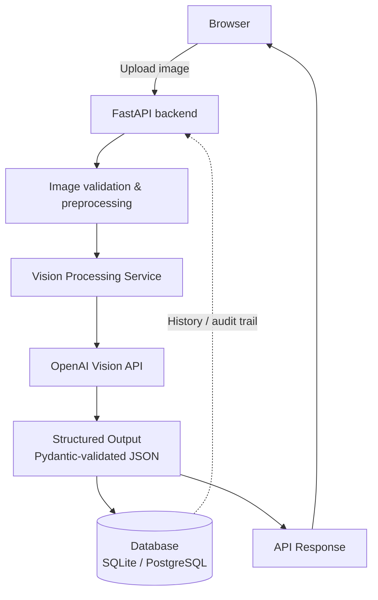

### Component Breakdown

| Component | Responsibility |
|---|---|
| **Browser (frontend)** | Captures/uploads the image, renders results, manages UI state |
| **FastAPI backend** | Routes requests, orchestrates the pipeline, enforces validation |
| **Image validation & preprocessing** | Confirms format/size, strips EXIF, resizes if needed, corrects orientation |
| **Vision Processing Service** | The only layer that talks to the vision provider's SDK - isolates that dependency |
| **OpenAI Vision API** | Performs the actual image understanding / OCR / extraction |
| **Structured Output layer** | Validates the model's response against a Pydantic schema before it touches the rest of the app |
| **Database** | Persists results for history, auditing, analytics, and re-export |
| **API Response** | A consistent, typed JSON contract back to the frontend |

### Why Isolate the Vision Provider Behind a Service

Putting all provider-specific code (SDK calls, prompt templates, model names) inside a single `vision_service.py`-style module means that switching providers, adding a fallback provider, or upgrading models later only requires changing one file - the rest of your application (routers, database, frontend) never needs to know which provider is in use.

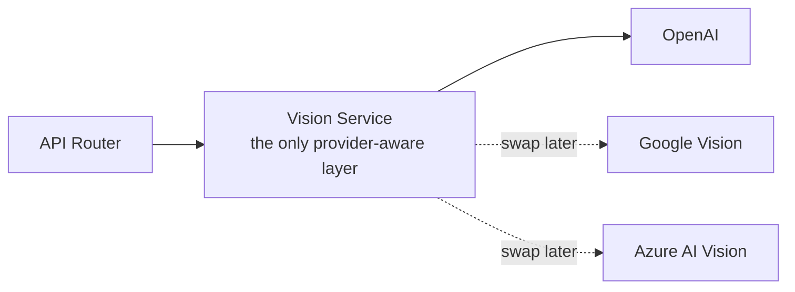

---

## 16. Security Best Practices

### API Keys

- Store API keys only in environment variables (`.env` files), never hard-coded in source.
- Never commit `.env` files to version control - always `.gitignore` them.
- Use different keys for development, staging, and production, so a compromised dev key can't touch production usage.
- Rotate keys immediately if one is ever exposed (accidentally committed, pasted in a support ticket, etc.).

### Image Validation

- Validate the actual file bytes (magic-byte signature), never trust the client-supplied `Content-Type` header or filename extension alone.
- Reject empty files and files that fail to decode as a valid image.
- Explicitly allow-list accepted formats rather than trying to block a list of "bad" ones.

### File Size Limits

- Enforce a maximum upload size at the application layer (e.g., reject anything over 8-10 MB) to prevent memory exhaustion and control API costs.
- Also configure a hard limit at the reverse proxy / web server layer (e.g., `client_max_body_size` in nginx) as defense in depth.

### Authentication & Authorization

- Any vision endpoint that costs money per call (i.e., all of them, when backed by a paid API) should require authentication in anything beyond a local personal project.
- Use authorization checks to ensure users can only access their own uploaded images and history records, not other users' data.
- Prefer short-lived tokens (JWTs, session tokens) over long-lived static API keys for end-user authentication.

### Malware Scanning

- Treat all uploaded files as untrusted input. Even "just an image" file can be crafted to exploit vulnerabilities in image-processing libraries.
- For high-risk deployments (public upload endpoints), consider scanning uploads with a service like ClamAV before processing.
- Keep image-processing libraries (Pillow, OpenCV) up to date - historical CVEs have targeted image parsers specifically.

### Rate Limiting

- Apply per-user and/or per-IP rate limits on vision endpoints to prevent abuse and control costs - a single malicious or buggy client could otherwise generate unbounded API spend.
- Return clear `429 Too Many Requests` responses with a `Retry-After` header so well-behaved clients can back off gracefully.

### Secure Uploads

- Never execute, `eval`, or otherwise interpret uploaded file content as code.
- Don't reflect the raw filename back into HTML responses without escaping - treat it as untrusted user input (a classic stored-XSS vector).
- Store uploaded images outside your application's web root, or better yet, avoid persisting raw images at all if you only need the extracted results (as demonstrated throughout this guide).

---

## 17. Performance Optimization

### Image Compression

Compress images before sending them to a vision API when file size (not detail) is the bottleneck - most providers apply their own internal resizing anyway, so sending an unnecessarily huge, uncompressed file mostly just adds upload latency and, in some pricing models, token cost.

```python
from PIL import Image
import io

def compress_image(data: bytes, max_dimension: int = 2048, quality: int = 85) -> bytes:
    image = Image.open(io.BytesIO(data))
    image.thumbnail((max_dimension, max_dimension))
    buffer = io.BytesIO()
    image.save(buffer, format="JPEG", quality=quality)
    return buffer.getvalue()
```

### Image Resizing

Downscaling very large images (e.g., a 12-megapixel phone photo) to a reasonable maximum dimension (1500-2500px on the longest side is a common sweet spot) usually has little to no impact on OCR/vision accuracy while meaningfully reducing upload time and, for token-based pricing models, cost.

### Async Processing

Use `async`/`await` throughout the request path - from the FastAPI endpoint down to the HTTP call to the vision provider - so a single slow vision request doesn't block your server's ability to handle other incoming requests concurrently.

```python
@app.post("/api/vision/ocr")
async def ocr_endpoint(file: UploadFile):
    image_bytes = await validate_upload(file)
    text = await ocr_service.extract(image_bytes)  # async all the way down
    return {"text": text}
```

### Caching

If the same image (or a very similar one) is likely to be processed more than once, cache results keyed by a content hash to avoid redundant, billable API calls:

```python
import hashlib

def image_cache_key(data: bytes) -> str:
    return hashlib.sha256(data).hexdigest()
```

### Batch Processing

For workloads processing many images at once (e.g., a nightly job over a folder of scanned documents), process them concurrently with a bounded number of simultaneous requests rather than either fully sequential (slow) or fully unbounded (risk of rate-limit errors):

```python
import asyncio

async def process_batch(images: list[bytes], concurrency: int = 5):
    semaphore = asyncio.Semaphore(concurrency)

    async def process_one(image: bytes):
        async with semaphore:
            return await ocr_service.extract(image)

    return await asyncio.gather(*(process_one(img) for img in images))
```

### Cost Optimization

- Choose the smallest/cheapest model that meets your accuracy bar - not every task needs the most capable (and most expensive) model available.
- Resize images before sending them (see above) - larger images generally cost more in token-based vision pricing.
- Cache repeated requests (see above).
- Batch non-urgent workloads into off-peak processing windows if your provider offers discounted batch pricing.

### Latency Reduction

- Use streaming responses (Section 11) so users see partial output immediately instead of waiting for the full response.
- Run image preprocessing (resize/compress) concurrently with other request setup work where possible.
- Keep your backend geographically close to your users and, if relevant, to your database, to minimize round-trip overhead on every leg of the request.

---

## 18. Deployment

### Local Machine

```bash
python -m venv venv
source venv/bin/activate      # Windows: venv\Scripts\activate
pip install -r requirements.txt
cp .env.example .env          # then edit .env with your API key
uvicorn main:app --reload
```

### Docker

```dockerfile
FROM python:3.12-slim

WORKDIR /app

COPY requirements.txt .
RUN pip install --no-cache-dir -r requirements.txt

COPY . .

EXPOSE 8000
CMD ["uvicorn", "main:app", "--host", "0.0.0.0", "--port", "8000"]
```

```bash
docker build -t vision-app .
docker run -p 8000:8000 --env-file .env vision-app
```

### Docker Compose

```yaml
version: "3.9"
services:
  web:
    build: .
    ports:
      - "8000:8000"
    env_file:
      - .env
    volumes:
      - ./data:/app/data
    restart: unless-stopped
```

```bash
docker compose up -d --build
```

### Railway

1. Push your repository to GitHub.
2. Create a new Railway project and select "Deploy from GitHub repo."
3. Add your environment variables (`OPENAI_API_KEY`, etc.) in the Railway dashboard's **Variables** tab.
4. Railway auto-detects the `Dockerfile` (or a `Procfile`/start command) and deploys automatically on every push.

### Render

1. Create a new **Web Service** on Render, connected to your GitHub repository.
2. Set the build command (e.g. `pip install -r requirements.txt`) and start command (e.g. `uvicorn main:app --host 0.0.0.0 --port $PORT`).
3. Add environment variables under the service's **Environment** tab.
4. Render builds and deploys automatically on every push to your chosen branch.

### Azure (App Service)

```bash
az webapp up \
  --name my-vision-app \
  --resource-group my-resource-group \
  --runtime "PYTHON:3.12"

az webapp config appsettings set \
  --name my-vision-app \
  --resource-group my-resource-group \
  --settings OPENAI_API_KEY="sk-..."
```

### AWS (Elastic Beanstalk, conceptual)

```bash
eb init -p docker my-vision-app
eb create my-vision-env
eb setenv OPENAI_API_KEY="sk-..."
eb deploy
```

### Google Cloud (Cloud Run)

```bash
gcloud run deploy vision-app \
  --source . \
  --region us-central1 \
  --set-env-vars OPENAI_API_KEY="sk-..." \
  --allow-unauthenticated
```

### Deployment Comparison

| Platform | Best for | Complexity | Notes |
|---|---|---|---|
| Local | Development, testing | Very low | No public access by default |
| Docker | Reproducible environments, any host | Low | Foundation for most cloud options below |
| Docker Compose | Local multi-service stacks (app + db) | Low | Great for local dev parity with production |
| Railway | Fast hobby/startup deployment | Low | Simple GitHub-based deploys, generous free tier |
| Render | Fast hobby/startup deployment | Low | Similar to Railway, strong free tier for small apps |
| Azure | Enterprise, Microsoft-centric orgs | Medium-High | Deep enterprise integration, more configuration |
| AWS | Large-scale, highly configurable systems | High | Maximum flexibility, steeper learning curve |
| Google Cloud | Container-native, serverless-first teams | Medium | Cloud Run is a strong serverless container option |

---

## 19. Repository Structure

A clean, production-ready structure for a small-to-medium Vision AI application:

```
vision-app/
├── main.py                 FastAPI app entrypoint, router wiring, lifespan events
├── config.py                Environment-variable driven settings (Pydantic)
├── logging_config.py         Logging setup (console + rotating file handler)
├── database.py                Database connection & schema (SQLite/PostgreSQL)
├── schemas.py                  Pydantic request/response models
├── exceptions.py                 Typed application exceptions + handlers
├── image_service.py               Upload validation, resizing, encoding
├── vision_service.py                The ONLY module that calls the vision provider's SDK
├── history_service.py                Persistence layer for past results
├── router_pages.py                    HTML page routes (if serving a UI)
├── router_vision.py                    Vision/OCR/analysis API routes
├── router_history.py                    History API routes
├── static/
│   ├── css/                              Stylesheets
│   ├── js/                                Frontend logic
│   └── icons/                              SVG icons
├── templates/                              Jinja2 HTML templates
├── tests/
│   ├── conftest.py                          Shared pytest fixtures
│   ├── test_vision_service.py                Unit tests (provider calls mocked)
│   └── test_api.py                            Endpoint integration tests
├── requirements.txt                            Production dependencies
├── requirements-dev.txt                         + pytest, httpx, etc.
├── .env.example                                  Environment variable template
├── .gitignore
├── Dockerfile
├── docker-compose.yml
├── README.md
└── LICENSE
```

### Purpose of Each Piece

| Path | Purpose |
|---|---|
| `main.py` | The single source of truth for how the app boots: creates the FastAPI instance, registers routers, runs startup/shutdown logic |
| `config.py` | Centralizes every environment variable behind a typed, validated settings object |
| `vision_service.py` | Isolates the third-party AI SDK - the rest of the app never imports it directly |
| `image_service.py` | Keeps validation/preprocessing logic separate from both the HTTP layer and the AI layer |
| `schemas.py` | The "contract" - every request/response shape lives here, in one place, so it's easy to audit |
| `exceptions.py` | Ensures errors are handled consistently instead of ad-hoc `try/except` blocks scattered everywhere |
| `tests/` | Mirrors the service layer, with the AI provider mocked so the suite runs offline, free, and fast |
| `static/` + `templates/` | Everything the browser sees, kept separate from backend logic |
| `.env.example` | Documents every configuration option without exposing real secrets |
## 20. Common Mistakes

Beginners (and experienced engineers new to Vision AI specifically) tend to repeat the same set of mistakes. Here are 25 of the most common, why they happen, and how to avoid them.

1. **Trusting the file extension instead of validating actual content.** Happens because it's the "obvious" check. Fix: sniff magic bytes, as shown in Section 12.

2. **Not handling EXIF orientation.** A sideways photo confuses OCR. Fix: apply EXIF orientation correction during preprocessing, or let the vision model's own robustness handle it - but test explicitly with rotated photos.

3. **Sending oversized images without resizing.** Increases latency and cost for no accuracy benefit. Fix: resize to a sane maximum dimension before sending (Section 17).

4. **Asking for free-form text and manually parsing it with regex.** Fragile and breaks whenever the model phrases things slightly differently. Fix: use native structured output / JSON schema features.

5. **Not setting a request timeout.** A hung network call can block a worker indefinitely. Fix: always configure an explicit timeout on the HTTP client.

6. **Hard-coding the API key in source code.** A critical security and cost risk. Fix: environment variables only, `.gitignore`'d `.env` files.

7. **Ignoring rate limits until production breaks.** Fix: implement retry-with-backoff and monitor for `429` responses from day one.

8. **Blindly trusting extracted totals/numbers without validation.** Fix: cross-check arithmetic (Section 7) and flag mismatches for review rather than silently accepting them.

9. **Not handling the "no text found" case.** Assuming every image has readable text leads to confusing empty-string bugs downstream. Fix: explicitly prompt for and handle the empty case.

10. **Mixing up RGB and BGR channel order.** Common when combining OpenCV with other libraries. Fix: always convert explicitly and add a comment noting the expected order.

11. **Not validating upload size before reading the whole file into memory.** Can allow memory-exhaustion attacks via huge uploads. Fix: check `Content-Length` and enforce limits at the proxy and app layer both.

12. **Assuming every PDF needs OCR.** Many PDFs already contain selectable text. Fix: try text extraction first; only fall back to vision-based OCR for image-only pages (Section 6).

13. **Forgetting to handle multi-page documents.** Fix: design your schema and pipeline around a list of pages/images from the start, not a single image.

14. **Using overly vague prompts** ("read this image") that produce inconsistent output shape. Fix: be explicit about exactly what to extract and how to format it (Section 14).

15. **Not testing with real-world messy data** (blurry photos, glare, low light, handwriting). Fix: build a test set of intentionally imperfect images, not just clean scans.

16. **Persisting raw uploaded images unnecessarily.** Increases storage cost and privacy/security exposure. Fix: only persist what you actually need (usually just the extracted result).

17. **No retry logic for transient API failures.** Fix: wrap provider calls with retry-with-exponential-backoff for retryable error classes (5xx, timeouts).

18. **Conflating "confidence" with "correctness."** A high-confidence wrong answer is still wrong. Fix: pair model confidence with independent validation logic where it matters (e.g., arithmetic checks).

19. **Not versioning prompts.** Silent prompt drift makes it impossible to reproduce or debug past behavior changes. Fix: keep prompts in version control alongside code, and log which prompt version produced each result.

20. **Ignoring cost until the bill arrives.** Fix: track and alert on API spend from day one; set hard usage limits in your provider dashboard.

21. **Blocking the event loop with synchronous I/O in an async FastAPI app.** Fix: use async HTTP clients end-to-end, or run blocking calls in a thread pool.

22. **Not logging enough context on failures.** A bare "extraction failed" is useless in production. Fix: log the request ID, image metadata (size/format, not content), and the specific exception.

23. **Skipping input validation on the frontend, relying only on the backend.** Leads to poor UX (large errors after a long upload). Fix: validate file type/size client-side too, in addition to (never instead of) backend validation.

24. **Assuming vision models understand precise pixel coordinates reliably.** General VLMs are good at relative/approximate spatial reasoning but not pixel-perfect localization. Fix: use dedicated object-detection models when exact bounding boxes matter.

25. **Not writing tests that mock the AI provider.** Tests that hit a real paid API are slow, flaky, and cost money on every CI run. Fix: mock the vision service layer in tests (Section 19's `vision_service.py` isolation makes this easy).

---

## 21. FAQ

**1. Do I need a GPU to use Vision AI APIs?**
No. When using a hosted API (OpenAI, Google, Azure, AWS), all the heavy computation happens on the provider's infrastructure. You only need a GPU if you're training or running your own local models.

**2. What's the difference between OCR and Document AI?**
OCR converts image text into machine-readable text. Document AI goes further, understanding the document's structure and meaning - which piece of text is a heading, a table cell, or a form value.

**3. Can vision models read handwriting reliably?**
Modern vision-language models handle handwriting far better than traditional OCR engines, especially for clear handwriting, but accuracy still drops for messy or highly stylized handwriting compared to printed text.

**4. Is it cheaper to run OCR locally or via an API?**
Local, open-source OCR (like Tesseract) has no per-request cost but requires more engineering effort for edge cases and typically has lower accuracy on messy inputs. API-based Vision AI has a per-request cost but higher out-of-the-box accuracy and much less maintenance.

**5. What image formats should I accept in my upload endpoint?**
JPEG, PNG, and WEBP cover the vast majority of real-world cases. Add GIF and BMP only if you have a specific need, since they're less common for photos/scans.

**6. How large can an image be before I should resize it?**
As a rule of thumb, resize anything larger than ~2000-2500px on the longest side before sending it to a vision API - larger sizes rarely improve accuracy further but do increase cost and latency.

**7. Should I store uploaded images in my database?**
Usually no - store the extracted results instead, and discard the raw image unless you have a specific reason (audit requirements, allowing re-processing) to keep it.

**8. How do I handle multiple languages in one document?**
Use an "auto-detect" language setting in your prompt rather than forcing a single language, and ask the model to preserve the original language rather than translating.

**9. What's the best way to validate a model's structured output?**
Use your SDK's native structured-output/schema feature (e.g., OpenAI's `text_format` with a Pydantic model) so invalid shapes are rejected before they reach your code.

**10. How do I reduce hallucination in extraction tasks?**
Explicitly instruct the model to omit or null out fields it cannot see, rather than guessing, and validate extracted numbers against independent checks where possible (Section 7).

**11. Can I use these techniques for video, not just images?**
Some providers support video input directly; otherwise, a common pattern is to extract representative frames and process them as a sequence of images.

**12. What's the difference between classification and detection?**
Classification answers "what is the overall subject of this image?" (one or more labels for the whole image). Detection answers "what objects are present, and where?" (labeled bounding boxes for each object).

**13. Do I need to fine-tune a model for OCR tasks?**
Usually not - general-purpose vision-language models handle most OCR tasks well out of the box with good prompting. Fine-tuning is more relevant for highly specialized, narrow, high-volume tasks where a smaller specialized model could be cheaper at scale.

**14. How do I handle rate limits gracefully?**
Implement retry logic with exponential backoff for `429` responses, and consider a request queue for batch workloads to keep your request rate within provider limits.

**15. What's a data URL, and why do I need it?**
A data URL embeds file content directly in a string (`data:image/png;base64,...`), letting you send an image to an API without hosting it at a public URL first - essential for freshly uploaded, not-yet-hosted images.

**16. How do I test vision features without spending money on every test run?**
Mock the vision service layer in your test suite (Section 19) so tests exercise your application logic without making real, billable API calls.

**17. Is Tesseract still worth using in 2026?**
Yes, for high-volume, well-defined, offline, or cost-sensitive OCR of clean printed text. It's less suitable for handwriting, messy photos, or tasks requiring understanding beyond raw transcription.

**18. How do I keep my OpenAI API key safe in a public GitHub repo?**
Never commit it. Use a `.env` file excluded via `.gitignore`, and provide a `.env.example` with placeholder values so collaborators know what to configure.

**19. What's the difference between synchronous and streaming responses?**
A synchronous response waits for the entire result before returning anything. A streaming response sends partial output as it's generated, improving perceived responsiveness for longer outputs.

**20. Should I use FastAPI or Flask for a vision API?**
FastAPI is generally preferred for new projects: native async support (important for I/O-bound vision API calls), automatic request/response validation via Pydantic, and auto-generated interactive API docs.

**21. How accurate is AI-based receipt/invoice extraction in practice?**
Very high for clearly printed documents, but always validate critical fields (especially totals) programmatically rather than assuming 100% accuracy, and provide a human review path for low-confidence or failed extractions.

**22. Can I run these examples with a different vision-capable model?**
Yes - the prompting patterns and application architecture in this guide are largely provider-agnostic; only the specific SDK calls in `vision_service.py`-style modules would need to change.

**23. What's the ideal image resolution for OCR?**
There's no single "ideal" number - the goal is that the smallest text in the image is still clearly legible to a human at the resolution you send. For most documents, 150-300 DPI equivalent (roughly 1500-2500px on the longest side) works well.

**24. How do I handle receipts with poor lighting or glare?**
Ask the model to do its best and flag uncertainty, apply basic preprocessing (contrast/brightness normalization) if you control image capture, and build a "low confidence -> human review" path for genuinely unreadable images.

**25. What's the difference between `responses.create` and `responses.parse` in the OpenAI SDK?**
`responses.create` returns free-form text output; `responses.parse` additionally validates and parses the output against a Pydantic schema you provide, giving you a typed Python object instead of a raw string to parse yourself.

**26. How do I extract tables reliably?**
Provide an explicit schema describing rows/columns, and consider asking the model to output the table as a list of row objects (each with named fields) rather than nested arrays, since named fields are less ambiguous to parse.

**27. What happens if the vision model can't read an image at all (e.g., pure noise)?**
A well-designed prompt (Section 14) instructs the model to report that no legible content was found, rather than fabricating a plausible-sounding but incorrect answer - always test this failure path explicitly.

**28. How do I handle very long documents (many pages)?**
Process pages independently (possibly in parallel, bounded by concurrency - Section 17) and merge results afterward, rather than trying to send an entire multi-page document as one oversized request.

**29. Should I build my own OCR model instead of using an API?**
Only if you have a very specific, high-volume, narrow use case where the accuracy/cost/latency tradeoff clearly favors a custom model - for most applications, a hosted vision API is faster to build, easier to maintain, and more accurate out of the box.

**30. How do I add authentication to a vision API without over-engineering?**
Start with a simple API-key or JWT-based auth middleware and per-user rate limiting; add more sophisticated authorization (roles, scopes) only once you actually need it.

**31. What's the safest way to let users upload images from their phone camera?**
Use `<input type="file" accept="image/*" capture="environment">` (Section 13) - it works without any custom camera-access JavaScript and respects the browser's native permission flow.

**32. How do I debug a bad extraction result?**
Log the prompt version, model name, and (temporarily, for debugging only) the input image alongside the output, so you can reproduce the exact request that produced the unexpected result.

**33. Do vision APIs understand charts and graphs?**
Modern vision-language models can generally describe trends and read approximate values from simple charts, though precise numerical extraction from complex charts is less reliable than from tables or text.

**34. How do I handle non-English documents?**
Set your prompt's language behavior explicitly (Section 14) - most modern vision-language models support dozens of languages natively without any special configuration.

**35. What's the best practice for naming downloaded export files?**
Base the filename on the source document's name (sanitized for filesystem safety) plus the export format, e.g. `invoice-2026-001.txt`, so users can correlate exports with their originals.

**36. How often should I update/rotate my API keys?**
Rotate immediately if a key is ever exposed; otherwise, periodic rotation (e.g., quarterly) as a general security hygiene practice is a reasonable default for production systems.

**37. Can I process images entirely offline with no internet connection?**
Only with local models (e.g., Tesseract, or a locally hosted open-weight vision-language model) - hosted APIs like OpenAI's require an internet connection by definition.

**38. What's the biggest performance bottleneck in a typical vision pipeline?**
Usually the network round-trip to the vision provider's API, not local preprocessing - which is why resizing/compressing images (Section 17) and using async I/O matter more than micro-optimizing local code.

**39. How do I handle a vision provider outage gracefully?**
Implement timeouts, clear user-facing error messages, and - for critical systems - a fallback provider or a local OCR fallback for degraded-but-functional service during an outage.

**40. Where should I start if I'm completely new to this field?**
Follow the Learning Roadmap in Section 23 - start with image fundamentals, build a simple OCR project, then progressively add structured extraction, a real API layer, and finally production concerns like security and deployment.

---

## 22. Best Practices Checklist

Use this checklist before considering a Vision AI application production-ready.

### Code Quality

- [ ] Consistent module boundaries (one file per concern - vision, images, history, etc.)
- [ ] Typed request/response models for every endpoint (Pydantic)
- [ ] No provider SDK calls outside a single, isolated service module
- [ ] Meaningful, typed custom exceptions instead of bare `Exception`
- [ ] Linting/formatting enforced (e.g., `ruff`, `black`) in CI

### Security

- [ ] API keys stored only in environment variables, never in source
- [ ] `.env` excluded via `.gitignore`
- [ ] Upload content validated by magic bytes, not just extension/MIME header
- [ ] File size limits enforced at both app and reverse-proxy layers
- [ ] Rate limiting on all AI-backed endpoints
- [ ] Authentication/authorization on any non-local deployment

### Performance

- [ ] Images resized/compressed before being sent to the vision API
- [ ] Async I/O used throughout the request path
- [ ] Caching in place for repeated/identical requests, if applicable
- [ ] Concurrency limits set for batch processing jobs
- [ ] Timeouts configured on every outbound HTTP call

### Documentation

- [ ] `README.md` covers setup, running, and architecture
- [ ] `.env.example` documents every configuration variable
- [ ] API endpoints documented (FastAPI's auto-generated `/docs` is a strong baseline)
- [ ] Prompts are version-controlled and documented alongside the code that uses them

### Testing

- [ ] Unit tests for validation and utility logic
- [ ] Integration tests for API endpoints, with the vision provider mocked
- [ ] Explicit tests for failure paths (invalid file, oversized file, empty result)
- [ ] Tests run in CI on every change

### Deployment

- [ ] Application containerized (Dockerfile) for reproducible deployments
- [ ] Environment-specific configuration via environment variables, not code changes
- [ ] Health-check endpoint (`/api/health` or similar) for uptime monitoring
- [ ] Logging configured with appropriate verbosity for production

### Scalability

- [ ] Stateless application layer (session/user state not held in process memory)
- [ ] Database choice appropriate for expected scale (SQLite for personal/small projects, PostgreSQL for multi-user production)
- [ ] Rate limiting and concurrency limits tuned to provider quotas
- [ ] Clear plan for horizontal scaling (multiple app instances behind a load balancer) if traffic grows
## 23. Learning Roadmap

A step-by-step path from zero Vision AI knowledge to shipping production systems.

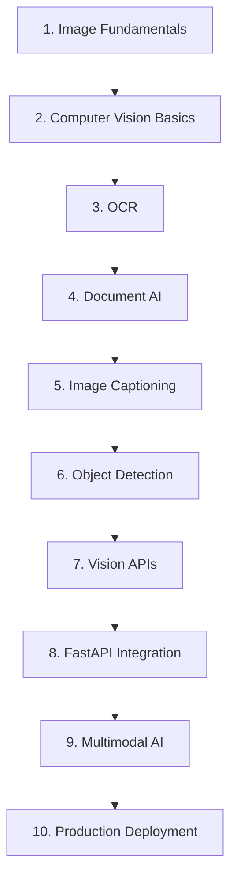

| Stage | Focus | Suggested milestone |
|---|---|---|
| 1. Image Fundamentals | Pixels, color spaces, formats, resolution | Load an image with Pillow, inspect its shape/mode/size in Python |
| 2. Computer Vision Basics | Traditional CV concepts, classification vs. detection vs. segmentation | Explain the difference between the three to someone else, in your own words |
| 3. OCR | How text extraction works, printed vs. handwritten | Build a script that OCRs a single image and prints the text |
| 4. Document AI | Layout, tables, forms, structured extraction | Extract 3+ structured fields from a sample invoice into a Pydantic model |
| 5. Image Captioning | Generating natural-language descriptions | Generate accessibility alt-text for 10 different images |
| 6. Object Detection | Bounding boxes, labels, confidence, when to use dedicated models | Understand when to reach for YOLO/Detectron2 vs. a general VLM |
| 7. Vision APIs | Provider SDKs, prompting, structured output, streaming | Call a vision API with both plain and structured output modes |
| 8. FastAPI Integration | Upload endpoints, validation, async processing | Build a working `/api/vision/extract` endpoint with proper validation |
| 9. Multimodal AI | Text+image, text+audio, text+video reasoning | Build a small tool that answers questions about an uploaded image |
| 10. Production Deployment | Security, performance, Docker, cloud deployment | Deploy your project (Section 18) and share the live URL |

**How to use this roadmap:** don't wait until you've "fully mastered" one stage before moving to the next - build a small, working project at each stage (see Section 24 for three complete project ideas) and let real bugs teach you the details.

---

## 24. Project Walkthroughs

### Project 1: OCR Reader

A tool that extracts text from any uploaded image.

**Architecture**


**Workflow:** user uploads an image -> backend validates format/size -> image is base64-encoded and sent to the vision model with an OCR-focused prompt -> extracted text is saved to SQLite -> JSON response returned to the browser and rendered.

**API design**

| Endpoint | Method | Purpose |
|---|---|---|
| `/api/ocr/extract` | POST | Upload an image, get back extracted text |
| `/api/ocr/stream` | POST | Same, but streamed as Server-Sent Events |
| `/api/history` | GET | List past extractions |
| `/api/history/{id}` | GET | Get one past extraction's full text |

**Folder structure:** see Section 19's general repository structure - this project needs only `ocr_service.py` (no separate classification step) plus the standard routing/persistence modules.

**Learning objectives:** image upload handling, calling a vision API, basic prompt design, persisting results, building a minimal frontend.

---

### Project 2: Receipt Analyzer

A tool that extracts structured, itemized data from receipt photos.

**Architecture**

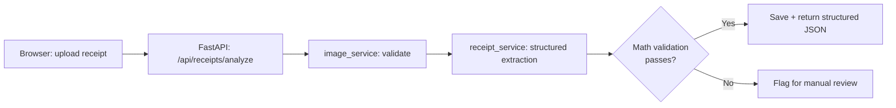

**Workflow:** user uploads a receipt photo -> backend validates the image -> a structured-output prompt (Section 7) extracts merchant, date, line items, tax, and total into a Pydantic `Receipt` model -> the pipeline validates that line items plus tax/tip roughly equal the total -> results are saved and returned, with low-confidence/mismatched receipts flagged for review.

**API design**

| Endpoint | Method | Purpose |
|---|---|---|
| `/api/receipts/analyze` | POST | Upload a receipt, get back structured JSON |
| `/api/receipts` | GET | List past receipts, with running spend totals |
| `/api/receipts/{id}/export` | GET | Export one receipt as CSV/JSON |

**Folder structure:** adds a `receipt_service.py` (structured extraction + math validation) and a richer `schemas.py` (`Receipt`, `LineItem` models) on top of the base structure from Section 19.

**Learning objectives:** structured output schemas, business-rule validation on top of AI output, designing a schema that tolerates missing/optional fields, building an "export" feature.

---

### Project 3: Image Caption Generator

A tool that generates accessibility-friendly captions for a batch of images.

**Architecture**

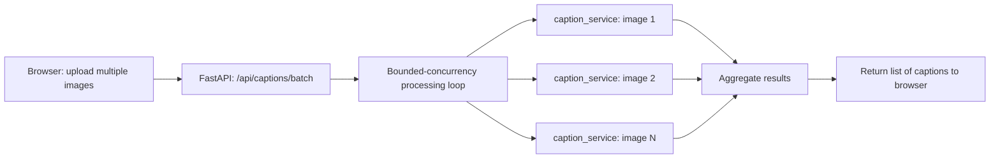

**Workflow:** user uploads multiple images at once -> backend processes them concurrently, bounded by a semaphore (Section 17) to respect rate limits -> each image gets a short, accessibility-focused caption -> results are returned as a list, in the same order as the uploads.

**API design**

| Endpoint | Method | Purpose |
|---|---|---|
| `/api/captions/batch` | POST | Upload multiple images, get back captions for each |
| `/api/captions/{id}` | GET | Retrieve a single previously generated caption |

**Folder structure:** adds `caption_service.py` and a batch-oriented endpoint that accepts `list[UploadFile]` instead of a single file, otherwise following Section 19's base structure.

**Learning objectives:** batch/concurrent processing, designing APIs around lists rather than single items, writing accessibility-focused prompts, maintaining result ordering across concurrent operations.

---

## 25. Comparison of AI Vision Providers

| Provider | OCR quality | Image understanding | Document analysis | Ease of use | Pricing model | Best use case |
|---|---|---|---|---|---|---|
| **OpenAI Vision** (GPT-4o / GPT-4.1) | Excellent, including handwriting | Excellent, strong general reasoning | Strong, especially with structured output | Very high - one API for many tasks | Pay-per-token (input + output) | General-purpose apps needing flexible, conversational vision reasoning |
| **Google Cloud Vision AI** | Excellent for printed text at scale | Good, specialized (labels, landmarks, logos) | Strong, especially with Document AI product line | Moderate - multiple specialized APIs | Pay-per-request, tiered by feature | High-volume, well-defined tasks (label detection, classic OCR at scale) |
| **Azure AI Vision** | Excellent, strong enterprise document support | Good, includes Read API and Analyze Image | Strong, especially with Azure Document Intelligence | Moderate - enterprise-oriented setup | Pay-per-transaction, tiered | Enterprises already invested in the Microsoft/Azure ecosystem |
| **AWS Rekognition** | Good for text-in-image; less document-focused | Good for object/scene detection, moderation | Basic (Textract is AWS's dedicated document product) | Moderate - many complementary AWS services | Pay-per-image/per-minute (video) | AWS-native pipelines, content moderation, media analysis |
| **Anthropic Vision** (Claude) | Excellent, strong reasoning over documents | Excellent, particularly strong at long, complex documents | Strong, good at multi-page structured reasoning | High - similar conversational API style | Pay-per-token (input + output) | Complex documents requiring careful, nuanced reasoning over content |

### Choosing a Provider

- **Need flexible, general-purpose reasoning across many task types?** OpenAI or Anthropic - a single conversational API adapts to OCR, captioning, extraction, and Q&A without switching products.
- **Need high-volume, well-defined, classic computer vision tasks at the lowest per-call cost?** Google Cloud Vision AI or AWS Rekognition's specialized endpoints.
- **Already standardized on a cloud provider for other infrastructure?** Staying within that ecosystem (Azure, AWS, or Google Cloud) often simplifies billing, IAM, and compliance.
- **Working with long, complex, multi-page documents requiring careful reasoning?** Anthropic's Claude models are well regarded for long-context document understanding.
- **Building a startup/prototype quickly?** OpenAI's Responses API (used throughout this guide) offers a good balance of capability, documentation quality, and ease of integration.

> Pricing and specific model capabilities change frequently across all providers - always check each provider's current pricing and documentation pages before making a final decision for a production system.

---

## 26. Further Resources

### Official Documentation

- OpenAI Platform Docs - platform.openai.com/docs
- Google Cloud Vision AI Docs - cloud.google.com/vision/docs
- Azure AI Vision Docs - learn.microsoft.com (search "Azure AI Vision")
- AWS Rekognition Docs - docs.aws.amazon.com/rekognition
- Anthropic Docs - docs.anthropic.com
- FastAPI Docs - fastapi.tiangolo.com
- Pydantic Docs - docs.pydantic.dev

### GitHub Repositories

- `tesseract-ocr/tesseract` - the leading open-source OCR engine
- `opencv/opencv` - the standard open-source computer vision library
- `ultralytics/ultralytics` - YOLO object detection models and tooling
- `openai/openai-python` - the official OpenAI Python SDK

### Books

- *Computer Vision: Algorithms and Applications* - Richard Szeliski
- *Deep Learning* - Ian Goodfellow, Yoshua Bengio, Aaron Courville
- *Programming Computer Vision with Python* - Jan Erik Solem
- *Designing Data-Intensive Applications* - Martin Kleppmann (for production system design fundamentals)

### Research Papers

- "ImageNet Classification with Deep Convolutional Neural Networks" (AlexNet, 2012)
- "Deep Residual Learning for Image Recognition" (ResNet, 2015)
- "An Image is Worth 16x16 Words: Transformers for Image Recognition at Scale" (ViT, 2020)
- "Learning Transferable Visual Models From Natural Language Supervision" (CLIP, 2021)
- "GPT-4 Technical Report" (OpenAI, 2023) - background on multimodal LLM capabilities

### Courses

- CS231n: Convolutional Neural Networks for Visual Recognition (Stanford, freely available lecture materials)
- Deep Learning Specialization (DeepLearning.AI, via Coursera)
- Full Stack Deep Learning (fullstackdeeplearning.com) - bridges research and production systems

### YouTube Channels

- Two Minute Papers - accessible summaries of new CV/AI research
- StatQuest with Josh Starmer - clear explanations of underlying ML concepts
- freeCodeCamp.org - long-form practical programming tutorials, including FastAPI and CV

### Blogs

- OpenAI Blog - openai.com/news
- Google AI Blog - ai.googleblog.com
- Anthropic Blog - anthropic.com/news
- PyImageSearch - pyimagesearch.com (practical, code-first computer vision tutorials)

### Communities

- r/computervision (Reddit)
- r/MachineLearning (Reddit)
- FastAPI Discord community
- Stack Overflow - tags: `computer-vision`, `ocr`, `fastapi`, `openai-api`
- Hugging Face Forums - for open-source model discussion

---

## Closing Notes

Vision AI has moved from a specialized research field to a practical, accessible tool that any competent Python developer can integrate into a real product within a few days. The fundamentals - how images are represented, how the pipeline from pixels to reasoning works, and how to prompt and validate a vision model's output - don't change quickly, even as specific models and providers do.

Start small: build the OCR Reader project from Section 24, get it running locally, then progressively add structure, validation, and production hardening as you work through the rest of this guide. That incremental path - not trying to build "the perfect production system" on day one - is the fastest way to genuine competence in this field.

**Good luck, and happy building.**
